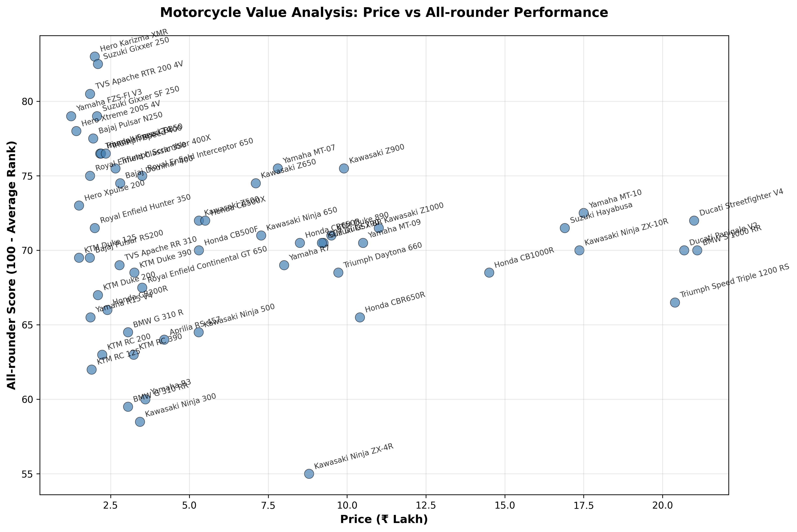

# 🏍️ Motorcycle Analysis Dashboard

A comprehensive data analysis platform for Indian motorcycle market with interactive visualizations, performance ratings, and value-for-money calculations.


## 🎯 Features

### 📊 Interactive Dashboard

- **Sortable Data Table**: Complete motorcycle database with 55+ bikes
- **Dynamic Filtering**: Filter by price range and motorcycle segments
- **Interactive Charts**: Customizable scatter plots with intelligent insights
- **Multiple Rankings**: Performance, VFM, and combined scoring systems


_Sample visualization: Price vs All-rounder Performance scatter plot showing value positioning across different motorcycle segments_

### 🧠 Intelligent Analysis

- **Smart Graph Insights**: AI-powered quadrant analysis with contextual explanations
- **Reference Lines**: Median and 75th percentile thresholds with annotations
- **Performance Tiers**: Gold/Silver/Bronze classification system
- **Highlighting Options**: Top 10 performers, VFM champions, and tier-based coloring

### 🏆 Ranking Systems

1. **Performance Leaders**: Best overall performance scores
2. **Value Champions**: Highest value-for-money ratings
3. **Total Overall Score**: Combined performance + VFM scores
4. **Balanced Rankings**: Average of performance and VFM ranks

### 📈 Advanced Visualizations

- **Dynamic X/Y Axis Selection**: Choose any metric combination
- **Contextual Insights**: Graph explanations change based on selected metrics
- **Threshold Tables**: Lists of bikes above performance thresholds
- **Statistical Context**: Quartile analysis and distribution insights

## 🚀 Quick Start

### Prerequisites

- Python 3.8+
- pip package manager

### Installation

1. **Clone the repository**

```bash
git clone https://github.com/your-username/motorcycle-analysis-dashboard.git
cd motorcycle-analysis-dashboard
```

2. **Create virtual environment**

```bash
python -m venv venv
source venv/bin/activate  # On Windows: venv\Scripts\activate
```

3. **Install dependencies**

```bash
pip install -r requirements.txt
```

4. **Run the application**

```bash
streamlit run bike_app.py
```

5. **Open your browser**
   Navigate to `http://localhost:8501`

## 📁 Project Structure

```
motorcycle-analysis-dashboard/
├── bike_app.py                 # Main Streamlit application
├── main.py                    # Core analysis engine
├── README.md                  # Project documentation
├── requirements.txt           # Python dependencies
├── .gitignore                # Git ignore rules
├── venv/                     # Virtual environment
└── faired_bikes_ratings_india_1to10L_aug2025.csv  # Generated data
```

## 🏍️ Motorcycle Database

> DEMO : [server](https://bikes-analysis-lvto8zz6rl8iocxhz6w6ls.streamlit.app/)

### Coverage

- **55+ motorcycles** across all major brands
- **Price range**: ₹1.25L to ₹21.10L
- **Categories**: Entry-level to superbikes

### Segments

- **Entry-level 150–200cc**: Hero Xtreme, Bajaj Pulsar RS200, Yamaha R15 V4
- **200-250cc Single**: Hero Karizma XMR, Suzuki Gixxer SF 250
- **300-400cc Single**: TVS Apache RR 310, BMW G 310 RR, Royal Enfield 350s
- **300–500cc Twins**: KTM RC 390, Kawasaki Ninja 300, Yamaha R3
- **Mid-weight 600–800cc**: Kawasaki Ninja 650, Yamaha MT-07, Suzuki GSX-8R
- **Superbikes 900cc+**: Hayabusa, Ninja ZX-10R, Ducati Panigale V2

### Evaluation Metrics

1. **Performance (10 Yrs)**: Long-term satisfaction and reliability
2. **Comfort (All Ages)**: Ergonomics for different age groups
3. **City Commute**: Urban traffic and daily usability
4. **Weekend Ride**: Highway and touring capabilities
5. **Pillion Ride**: Passenger comfort and accommodation
6. **Fun (10+ yrs)**: Excitement factor and long-term engagement

## 🎯 Usage Guide

### Dashboard Navigation

#### 📊 Data Table Tab

- **Filter motorcycles** by price range and segments
- **Sort by any column** to find specific criteria
- **Export functionality** for further analysis

#### 📈 Interactive Charts Tab

- **Select X and Y axes** from any available metrics
- **Choose highlighting options**:
  - Top 10 Overall Score
  - Top 10 Performance
  - Top 10 VFM
  - Performance Tiers (Gold/Silver/Bronze)
- **Read graph intelligence** for contextual insights
- **View threshold tables** for actionable bike lists

#### 🏆 Rankings Tab

- **Total Overall Score**: Performance + VFM combined
- **Overall Ranked Bikes**: Balanced ranking system
- **Top Performance**: Highest scoring motorcycles
- **Best VFM**: Greatest value for money
- **Segment Analysis**: Category-wise comparisons

## 🔧 Technical Details

### Key Algorithms

#### VFM Calculation

```python
value_raw = df["Total score"] / df["Price (₹ Lakh)"]
df["VFM score"] = 10 * (value_raw / value_raw.max())
```

#### Overall Ranking

```python
df['Performance_Rank'] = df['Total (out of 10)'].rank(method='dense', ascending=False)
df['VFM_Rank'] = df['VFM score'].rank(method='dense', ascending=False)
df['Overall_Rank'] = (df['Performance_Rank'] + df['VFM_Rank']) / 2
```

#### Performance Tiers

- 🥇 **Excellent**: 7.5+ total score
- 🥈 **Very Good**: 6.5-7.5 total score
- 🥉 **Good**: 5.5-6.5 total score
- 📊 **Average**: <5.5 total score

## 🚀 Deployment

### Local Development

```bash
streamlit run bike_app.py
```

### Streamlit Cloud

1. Push to GitHub repository
2. Connect to [Streamlit Cloud](https://streamlit.io/cloud)
3. Deploy with one click

## 🤝 Contributing

1. Fork the repository
2. Create feature branch (`git checkout -b feature/amazing-feature`)
3. Commit changes (`git commit -m 'Add amazing feature'`)
4. Push to branch (`git push origin feature/amazing-feature`)
5. Open Pull Request

## 📄 License

This project is licensed under the MIT License.

## 👥 Authors

- **Apoorv Shah** - _Initial work_

## 🙏 Acknowledgments

- **Streamlit** for the amazing framework
- **Plotly** for interactive visualizations
- **Indian motorcycle** community for insights

---

**⭐ Star this repository if you found it helpful!**

Made with ❤️ for the Indian motorcycle community
